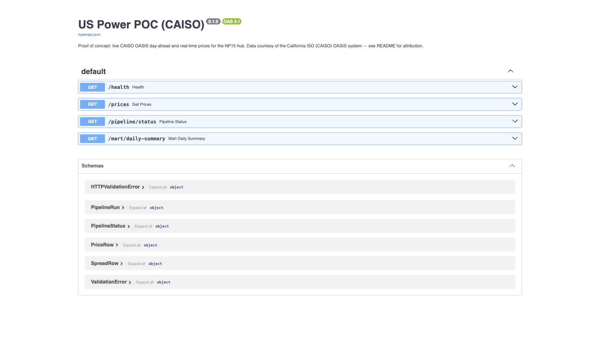
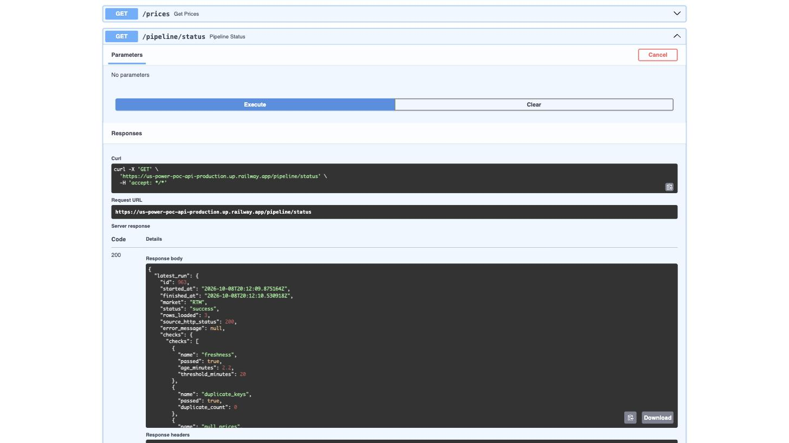

# US Power POC (CAISO prices)

[](https://github.com/JonathanThangadurai/us-power-poc/actions/workflows/ci.yml)

**This is a proof of concept.** It is a small, live pipeline that pulls real CAISO day-ahead and
real-time prices for one hub (NP15), validates and stores them idempotently in PostgreSQL across
raw/staging/mart layers, and exposes them through a FastAPI service with monitoring built in. It
deliberately does not include a dashboard, a forecasting model, additional ISOs, or heavier
engineering tooling (mypy, Prometheus) — see "Known limitations" below.

**Live right now** - real `/docs` and real `/pipeline/status` output, not mockups:




## Attribution

Price data is sourced from the **California ISO (CAISO) OASIS** system
(`http://oasis.caiso.com`), queried anonymously with no API key or account. CAISO's terms of use
permit reuse of its public materials provided the California ISO is credited, and state that data
is provided "AS IS" with no warranty of accuracy or completeness — decisions based on it are the
user's own responsibility. This project credits CAISO here and in the API description served at
`/docs`.

## Architecture

```
            every 5 min                      once a day
      ┌────────────────────┐          ┌────────────────────┐
      │ CAISO OASIS         │          │ CAISO OASIS         │
      │ PRC_INTVL_LMP (RTM)  │          │ PRC_LMP (DAM)        │
      └──────────┬──────────┘          └──────────┬──────────┘
                 │ zip -> CSV                      │ zip -> CSV
                 ▼                                 ▼
      ┌─────────────────────────────────────────────────────┐
      │   app/scheduler.py  (asyncio loop inside app process) │
      │   app/ingest.py     (fetch -> pivot -> check -> load)  │
      └──────────────────────────┬────────────────────────────┘
                                  ▼
                 app/transform.py: pivot one-row-per-component
                 CSV rows into one row per node-interval
                                  ▼
                 app/monitoring.py: freshness / duplicates / nulls
                 (runs BEFORE anything is loaded, not after)
                      pass ▼                     ▼ fail
      ┌──────────────────────────┐   ┌──────────────────────────┐
      │ prices (staging/mart-fed) │   │ quarantine_prices         │
      └──────────────────────────┘   └──────────────────────────┘
      raw_prices: the untouched fetch, once per run, regardless of pass/fail
                                  ▼
      mart_daily_summary / mart_hourly_spread (views on prices)
                                  ▼
                 FastAPI (app/main.py, app/api/routes.py)
            /health  /prices  /mart/daily-summary  /pipeline/status  /docs
```

The scheduler runs as an `asyncio` background task inside the same process as the API (started in
FastAPI's `lifespan`), not as GitHub Actions cron, because cron on Actions cannot reliably hit a
5-minute cadence.

## Data lineage: raw -> staging -> mart

1. **Raw** (`raw_prices`): the untouched CSV rows CAISO returned for a given fetch, recorded once
   per `pipeline_runs` row regardless of whether that run passes or fails its quality checks. Never
   mutated, never pivoted - this is what a reprocess would replay from.
2. **Staging/conformed** (`prices`): `app/transform.py` pivots the raw one-row-per-component CSV
   into one row per node-interval (`lmp`, `energy`, `congestion`, `loss`), upserted on the unique
   key `(node, market, interval_start_utc)` so a replay or backfill of the same window produces
   identical rows, not duplicates. **A batch only reaches this table if it passes all three quality
   checks** (see Monitoring below) - checks run before loading, not after.
3. **Quarantine** (`quarantine_prices`): a batch that fails a check lands here instead, tagged with
   which check failed and the `pipeline_runs` id that produced it - inspectable, not silently
   dropped and not silently let through either.
4. **Mart** (`mart_daily_summary`, `mart_hourly_spread` - plain SQL views over `prices`): the
   aggregates other consumers actually want, computed once as views rather than re-derived inline
   by every caller. `GET /prices?market=SPREAD` and `GET /mart/daily-summary` both read these.

Schema changes to all of this are managed by Alembic (`migrations/`), not ad-hoc `CREATE TABLE IF
NOT EXISTS` calls - see "Migrations" below.

All timestamps are stored and returned in UTC (CAISO's `INTERVALSTARTTIME_GMT`/`...ENDTIME_GMT`
are already UTC), which sidesteps DST ambiguity entirely — see
`tests/test_transform.py::test_pivot_handles_dst_transition_without_duplicate_or_missing_intervals`,
which replays a real recorded response spanning the November 2025 US fall-back transition.

## A real CAISO trap this client guards against

CAISO's OASIS API always answers **HTTP 200**, even when a query is wrong or has no data. Querying
the real-time query name with the day-ahead market (or vice versa) does not error — it returns a
zip containing an **XML document with `ERR_CODE`/`ERR_DESC`** instead of a CSV. Verified live:

```
<m:ERROR>
  <m:ERR_CODE>1000</m:ERR_CODE>
  <m:ERR_DESC>No data returned for the specified selection</m:ERR_DESC>
</m:ERROR>
```

`app/caiso_client.py` detects this (zip contains `.xml` instead of `.csv`) and raises
`CaisoEmptyResponseError`, which `app/ingest.py` records as a **failed** `pipeline_runs` row — not
a silent empty success. This is covered by a recorded-fixture test
(`tests/test_caiso_client.py::test_fetch_raises_on_empty_response_xml`), using the real response
captured from the live API.

## Running it

### Live deployment

Deployed on [Railway](https://railway.com): the `us-power-poc-api` service builds this repo's
`Dockerfile` and runs alongside a managed Postgres service in the same project. Railway's own
GitHub integration redeploys the service on every push to `main` (not the GitHub Actions workflow
itself — Actions' `deploy` job instead curls the live `/health` endpoint after `build` passes, as a
CI-visible check that the deploy landed and the app is up).

- Public URL: https://us-power-poc-api-production.up.railway.app
- `/docs`: https://us-power-poc-api-production.up.railway.app/docs

### Locally with Docker Compose

```bash
cp .env.example .env
docker compose up --build
```

- API: http://localhost:8000/docs
- The scheduler starts automatically inside the `app` container and begins pulling real-time
  prices every 5 minutes and day-ahead prices once a day.

### Locally without Docker

```bash
python3.12 -m venv .venv && source .venv/bin/activate
pip install -r requirements-dev.txt
createdb energytrade   # or point DATABASE_URL at any Postgres
cp .env.example .env   # edit DATABASE_URL if needed
uvicorn app.main:app --reload
```

### Backfill

```bash
python -m scripts.backfill --market RTM --start 2025-09-01T00:00:00+00:00 --end 2025-09-02T00:00:00+00:00
python -m scripts.backfill --market DAM --start 2025-09-01T00:00:00+00:00 --end 2025-09-08T00:00:00+00:00
```

Backfill goes through the same `run_ingest` path as the live scheduler, so it reproduces identical
rows for any window already ingested live (verified: re-running a backfill over a window the
scheduler already loaded leaves row count and values unchanged).

### Tests

```bash
pytest -v        # uses recorded CAISO fixtures in tests/fixtures/ (real responses, incl. empty/DST cases)
ruff check .
```

## Migrations

Schema changes go through Alembic (`migrations/versions/`), run automatically on startup
(`app/db.init_schema()` calls `alembic upgrade head` rather than executing raw SQL). Revision
`0001` is written as `CREATE TABLE IF NOT EXISTS` specifically so it's safe to run against the live
database, whose `prices`/`pipeline_runs` tables predate Alembic's adoption here - running it just
records that revision as satisfied without touching anything. Later revisions (e.g. `0002`, which
added `raw_prices`, `quarantine_prices`, and the mart views) are purely additive for the same
reason: a live service's schema should never need coordinated downtime with a deploy for this
project's scale of change.

```bash
alembic upgrade head      # apply manually, e.g. against a local DB
alembic downgrade -1      # roll back the most recent revision
```

## API

- `GET /health` — DB connectivity, configured node, server time.
- `GET /prices?market=DAM|RTM|SPREAD&start=...&end=...&limit=&offset=` — price rows, or the
  derived hourly DAM-RTM spread when `market=SPREAD` (reads `mart_hourly_spread`).
- `GET /mart/daily-summary?node=&market=&limit=&offset=` — daily avg/min/max/stddev per node and
  market (reads `mart_daily_summary`).
- `GET /pipeline/status` — latest and recent `pipeline_runs` rows (status, rows loaded, checks).
- `GET /docs` — OpenAPI UI (serves as the front end for this POC).

## Monitoring

Three checks run on every fetched batch **before** it's loaded anywhere, and are written to
`pipeline_runs.checks`, visible at `/pipeline/status`:

1. **Freshness** — age of the newest interval *in this batch* vs. a threshold
   (`FRESHNESS_THRESHOLD_MINUTES`, default 20 min for RTM; DAM gets a 25-hour allowance since it
   only publishes once a day).
2. **Duplicate keys** — no duplicate `(node, market, interval_start_utc)` within the batch.
3. **Null prices** — no null `lmp` values in the batch.

A batch that passes is upserted into `prices`; a batch that fails is written to
`quarantine_prices` instead (tagged with which check failed) and that `pipeline_runs` row is marked
`status = 'failure'` - the serving table never sees data that hasn't passed. If `ALERT_WEBHOOK_URL`
is set, a failure also posts a one-line JSON payload to it (Slack/Telegram/generic webhook
compatible). See `tests/test_quarantine.py` for this verified end-to-end with a crafted bad batch.

## Known limitations

- Single hub (NP15) and single ISO (CAISO) — no ERCOT/PJM adapter, no dashboard, no forecasting.
- No mypy, no Prometheus/Grafana — ruff + pytest only.
- CAISO's `/health`-equivalent uptime is not independently monitored by an external service in
  this repo; that is called out as a next step rather than built in.
- `prices.raw_payload` still exists as a column (left in place rather than dropped, to avoid a
  breaking schema change on the live deployment) but is no longer populated for new rows - the raw
  zone is `raw_prices` now. A future migration can drop it once nothing depends on it.

## Next steps

- Add a second hub or ERCOT/PJM behind the same adapter interface.
- A minimal trader-facing dashboard page over the existing `/prices` endpoint.
- External uptime check on `/health` plus a documented injected-failure drill.
- Drop the now-unused `prices.raw_payload` column once nothing reads it.
